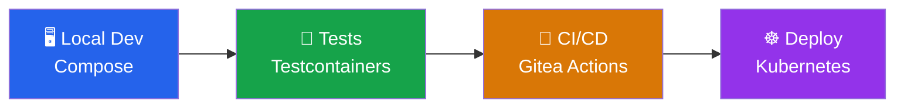

# Introduction: Meet the App

Welcome to **The Containerized SDLC** lab! By the end, you'll have taken a real Node.js application from a bare source tree all the way through local development, automated testing, a CI/CD pipeline, and a live Kubernetes deployment — with containers playing a starring role at every step.

## What you'll build

**TaskFlow** is a simple task management REST API backed by PostgreSQL. The application code is already written and waiting for you. Your job is to containerize the *process* around it:

| Stage | What you'll do |
|---|---|
| 🖥️ **Local dev** | Write a `compose.yaml` to spin up a database and a visualizer |
| 🧪 **Testing** | Write integration tests that use Testcontainers to start a real database |
| 🔄 **CI/CD** | Write a Gitea Actions pipeline that tests, builds, and pushes a container image |
| ☸️ **Deploy** | Write Kubernetes manifests and deploy to a live k3s cluster |

By the end, you'll see first-hand why a containerized SDLC makes software more portable, consistent, and reproducible.

## The SDLC journey



## Tour the project

Start by confirming the environment is ready and getting familiar with the starter code.

1. Verify the key tools are available:

    ```bash
    node --version && docker --version && kubectl version --client --short 2>/dev/null || kubectl version --client
    ```

2. List the project files:

    ```bash
    ls -la
    ```

    You should see `src/`, `package.json`, and `Dockerfile` — the core application that's ready to go.

3. Take a quick look at the API in the :fileLink[src/app.js]{path="src/app.js"} file. Specifically, the app:

    - Exposes three endpoints: `GET /api/tasks`, `POST /api/tasks`, and `DELETE /api/tasks/:id`
    - Reads database connection details from environment variables (with sensible defaults)

4. Install the Node.js dependencies:

    ```bash
    npm install
    ```

    This installs Express and the PostgreSQL client (`pg`). It also generates a `package-lock.json` that you'll commit in a later section.

5. Try starting the app right now to see what happens without a database:

    ```bash
    node src/app.js
    ```

    > [!NOTE]
    > You'll see something like `Failed to start: connect ECONNREFUSED 127.0.0.1:5432`. The app can't connect to PostgreSQL because there isn't one running yet.

That error is exactly the problem you'll solve in the next section. The application needs a database, and the cleanest way to provide one — without installing anything on your machine — is Docker Compose.
