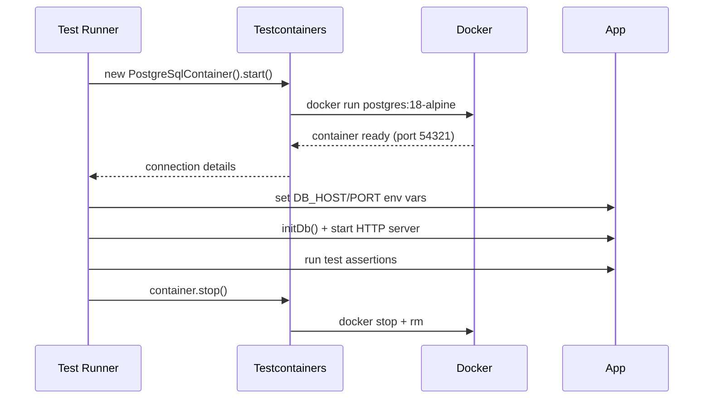

# Integration Testing with Testcontainers

Unit tests are great, but TaskFlow's real logic happens at the database boundary. You need integration tests that talk to an actual PostgreSQL instance.

The naïve approach is to point tests at your Compose database. But that means tests share state, run order matters, and a developer without Compose running gets failures. It doesn't scale.

**Testcontainers** solves this. It's a library that programmatically starts real Docker containers from inside your test code. Each test run gets a fresh, isolated database — no setup scripts, no shared state, no "works on my machine."

## How it works



Your test spins up a real PostgreSQL container, runs the full test suite against it, then tears it down. No mocks. No shared state.

## Add the Testcontainers dependency

The starter project only ships with runtime dependencies. Testcontainers is a dev/test tool, so you'll add it now.

1. Install the Testcontainers packages:

    ```bash
    npm install --save-dev testcontainers @testcontainers/postgresql
    ```

    This adds two packages to `devDependencies` in `package.json` and updates `package-lock.json`. The `@testcontainers/postgresql` module provides a typed `PostgreSqlContainer` class that handles the Postgres-specific setup and exposes convenient helpers like `getMappedPort()` and `getConnectionUri()`.

## Write the tests

2. Create a file named `test/tasks.test.js` with the following contents:

    ```javascript save-as=test/tasks.test.js
    const { test, before, after } = require('node:test');
    const assert = require('node:assert/strict');
    const http = require('node:http');
    const { PostgreSqlContainer } = require('@testcontainers/postgresql');
    const { closePool } = require('../src/db');

    let container;
    let server;
    let baseUrl;

    before(async () => {
      // Start a fresh PostgreSQL container for this test run
      console.log('Starting PostgreSQL container...');
      container = await new PostgreSqlContainer('postgres:18-alpine').start();

      // Point the app at the test container
      process.env.DB_HOST = container.getHost();
      process.env.DB_PORT = String(container.getMappedPort(5432));
      process.env.DB_NAME = container.getDatabase();
      process.env.DB_USER = container.getUsername();
      process.env.DB_PASSWORD = container.getPassword();

      // Initialize the schema and start an HTTP server on a random port
      const { initDb } = require('../src/db');
      await initDb();

      const app = require('../src/app');
      server = http.createServer(app);
      await new Promise((resolve) => server.listen(0, resolve));
      baseUrl = `http://localhost:${server.address().port}`;
      console.log(`Test server ready at ${baseUrl}`);
    });

    after(async () => {
      server?.close();
      await closePool();
      await container?.stop();
    });

    test('GET /health returns ok', async () => {
      const res = await fetch(`${baseUrl}/health`);
      assert.equal(res.status, 200);
      const body = await res.json();
      assert.equal(body.status, 'ok');
    });

    test('GET /api/tasks returns an empty list initially', async () => {
      const res = await fetch(`${baseUrl}/api/tasks`);
      assert.equal(res.status, 200);
      const tasks = await res.json();
      assert.deepEqual(tasks, []);
    });

    test('POST /api/tasks creates a task', async () => {
      const res = await fetch(`${baseUrl}/api/tasks`, {
        method: 'POST',
        headers: { 'Content-Type': 'application/json' },
        body: JSON.stringify({ title: 'Buy groceries', description: 'Milk, eggs, bread' }),
      });
      assert.equal(res.status, 201);
      const task = await res.json();
      assert.equal(task.title, 'Buy groceries');
      assert.ok(task.id, 'Task should have an id');
    });

    test('GET /api/tasks returns the created task', async () => {
      const res = await fetch(`${baseUrl}/api/tasks`);
      assert.equal(res.status, 200);
      const tasks = await res.json();
      assert.equal(tasks.length, 1);
      assert.equal(tasks[0].title, 'Buy groceries');
    });

    test('POST /api/tasks requires a title', async () => {
      const res = await fetch(`${baseUrl}/api/tasks`, {
        method: 'POST',
        headers: { 'Content-Type': 'application/json' },
        body: JSON.stringify({ description: 'No title provided' }),
      });
      assert.equal(res.status, 400);
    });

    test('DELETE /api/tasks/:id removes the task', async () => {
      const listRes = await fetch(`${baseUrl}/api/tasks`);
      const tasks = await listRes.json();
      const id = tasks[0].id;

      const delRes = await fetch(`${baseUrl}/api/tasks/${id}`, { method: 'DELETE' });
      assert.equal(delRes.status, 200);

      const finalRes = await fetch(`${baseUrl}/api/tasks`);
      const remaining = await finalRes.json();
      assert.equal(remaining.length, 0);
    });
    ```

    Take a moment to read through the `before` hook. Notice:
    - A `PostgreSqlContainer` is started using the exact same `postgres:18-alpine` image you used in Compose.
    - The connection details are read directly from the container object (`getHost()`, `getMappedPort()`, etc.) and written into `process.env`.
    - Because `src/db.js` creates its connection pool lazily (only when the first query is executed), setting `process.env` *before* the first DB call is all that's needed.

3. Run the tests:

    ```bash
    npm test
    ```

    > [!NOTE]
    > The first run pulls the `postgres:18-alpine` image if it isn't cached yet. Subsequent runs are much faster.

    You should see output similar to:
    ```plaintext no-copy-button
    Starting PostgreSQL container...
    Test server ready at http://localhost:XXXXX
    ✔ GET /health returns ok
    ✔ GET /api/tasks returns an empty list initially
    ✔ POST /api/tasks creates a task
    ✔ GET /api/tasks returns the created task
    ✔ POST /api/tasks requires a title
    ✔ DELETE /api/tasks/:id removes the task
    ℹ tests 6
    ℹ pass 6
    ```

> [!TIP]
> Run `npm test` a second time. Because the container is ephemeral, every run starts from a clean slate. Tests always start with an empty database — no teardown scripts needed.

## What you've got

Your tests are now completely self-contained. They start their own database, run, and clean up after themselves. Any developer (or CI server) with Docker available can run `npm test` and get a reliable result — no external setup required.

That reliability is exactly what you want to carry into your CI pipeline, which you'll build in the next section.
