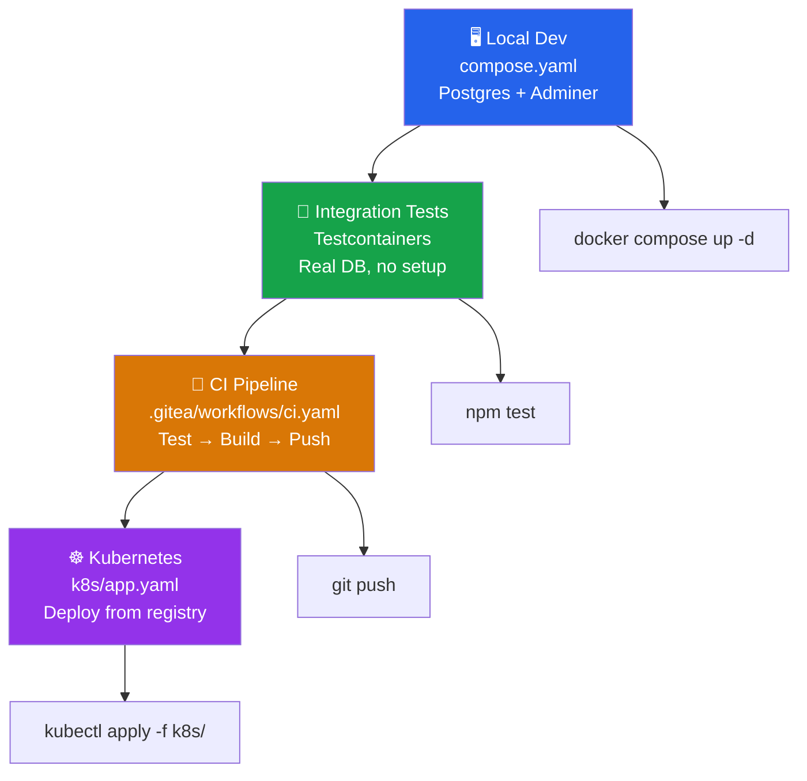

# The Containerized SDLC: A Recap

You've just walked the entire software development lifecycle — from a blank local environment to a live Kubernetes deployment. Take a moment to appreciate the full picture.

## The journey you completed



Every stage used containers. Let's look at what that actually bought you.

## The three pillars of a containerized SDLC

### 🔁 Portability

The application runs identically in every environment because the container image captures the runtime, dependencies, and configuration as a single artifact. The image you built in CI is the *exact same artifact* running in Kubernetes — not a re-build, not a re-install, the same bits.

**Before containers:** "Works on my machine" was a common excuse. Developers had different PostgreSQL versions, different Node.js versions, different OS paths.

**After containers:** `docker compose up -d` and `npm test` work the same on every developer's machine, in every CI runner, in every environment.

### 🔒 Consistency

Your dev environment (`compose.yaml`) used `postgres:18-alpine`. Your tests (Testcontainers) used `postgres:18-alpine`. Your production deployment (`k8s/postgres.yaml`) used `postgres:18-alpine`. The database your code runs against is identical everywhere.

This is more than a convenience — it eliminates an entire class of bugs that only surface in production because the environment was slightly different.

### 🚀 Reproducibility

Everything needed to run, test, and deploy the application is defined in code:

| What | Where |
|---|---|
| Dev infrastructure | `compose.yaml` |
| Test setup | `test/tasks.test.js` (Testcontainers) |
| CI pipeline | `.gitea/workflows/ci.yaml` |
| Production deployment | `k8s/` |

Any developer can clone this repository and reproduce the entire SDLC on their own machine or cluster. There are no undocumented setup steps, no shared servers with mysterious configs, no tribal knowledge required.

## Try the live app one more time

Your task list is still live at `app.dockerlabs.xyz`. Add one more task to mark the occasion:

```bash
curl -s -X POST http://app.dockerlabs.xyz/api/tasks \
  -H "Content-Type: application/json" \
  -d '{"title":"Master the containerized SDLC","description":"Done!"}'
```

```bash
curl -s http://app.dockerlabs.xyz/api/tasks
```

::tabLink[View the live app]{href="http://app.dockerlabs.xyz/api/tasks" title="Deployed App" id="deployed-app"}

## What you accomplished

- ✅ Wrote a `compose.yaml` to provision a local PostgreSQL database and Adminer — zero installation required
- ✅ Wrote integration tests using Testcontainers — self-contained, reliable, and CI-friendly
- ✅ Wrote a Gitea Actions CI pipeline that tests, builds, and pushes a container image automatically
- ✅ Wrote Kubernetes manifests to deploy the app to a live cluster behind a Traefik ingress

## Where to go next

- **Multi-stage builds** — optimize your `Dockerfile` further with build stages to reduce image size
- **Secrets management** — replace hardcoded passwords with Kubernetes Secrets or an external vault
- **Health probes** — add `livenessProbe` and `readinessProbe` to your Kubernetes Deployment for zero-downtime rollouts
- **Helm charts** — package your Kubernetes manifests as a Helm chart for reusable, configurable deployments
- **Docker Scout** — scan your container image for vulnerabilities as part of the CI pipeline
